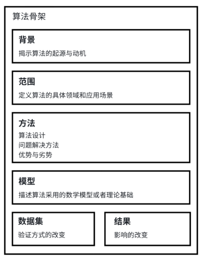

# Algorithm-Skeleton-Mining
Tracing The Evolution of Algorithm Skeleton in Paper Collections

追踪论文集合中的算法框架的变化

## 1 Algorithm Skeleton Extraction of Papers
### 1.1 Deploy the ChatGLM-6B-int4 model locally
### 硬件需求

| **量化等级**   | **最低 GPU 显存**（推理） | **最低 GPU 显存**（高效参数微调） |
| -------------- | ------------------------- | --------------------------------- |
| INT4           | 6 GB                      | 7 GB                              |
### 1.2 Definition of algorithm skeleton
#### Six-dimensional algorithm skeleton

针对六个维度的算法特征信息, 我们设计了六种情况的Prompt来引导LLM提取特征

| **维度特征**   | **提示模版**  |
| -------------- | ------------------------- |
| INT4           | 6 GB                      |

### 1.3 Construction of Algorithm Skeleton Dataset of Survey paper Citations

## 2 Algorithmic Relation Network
### 2.1 Domain Clustering
#### 2.1.1 Word2Vec

#### 2.1.2 tf-idf

#### 2.1.3 K-means Clustering

### 2.2 Evolution Relation Mining
#### 2.2.1 sentence-BERT

#### 2.2.2 cosine similarity

### 2.3 Visualization

